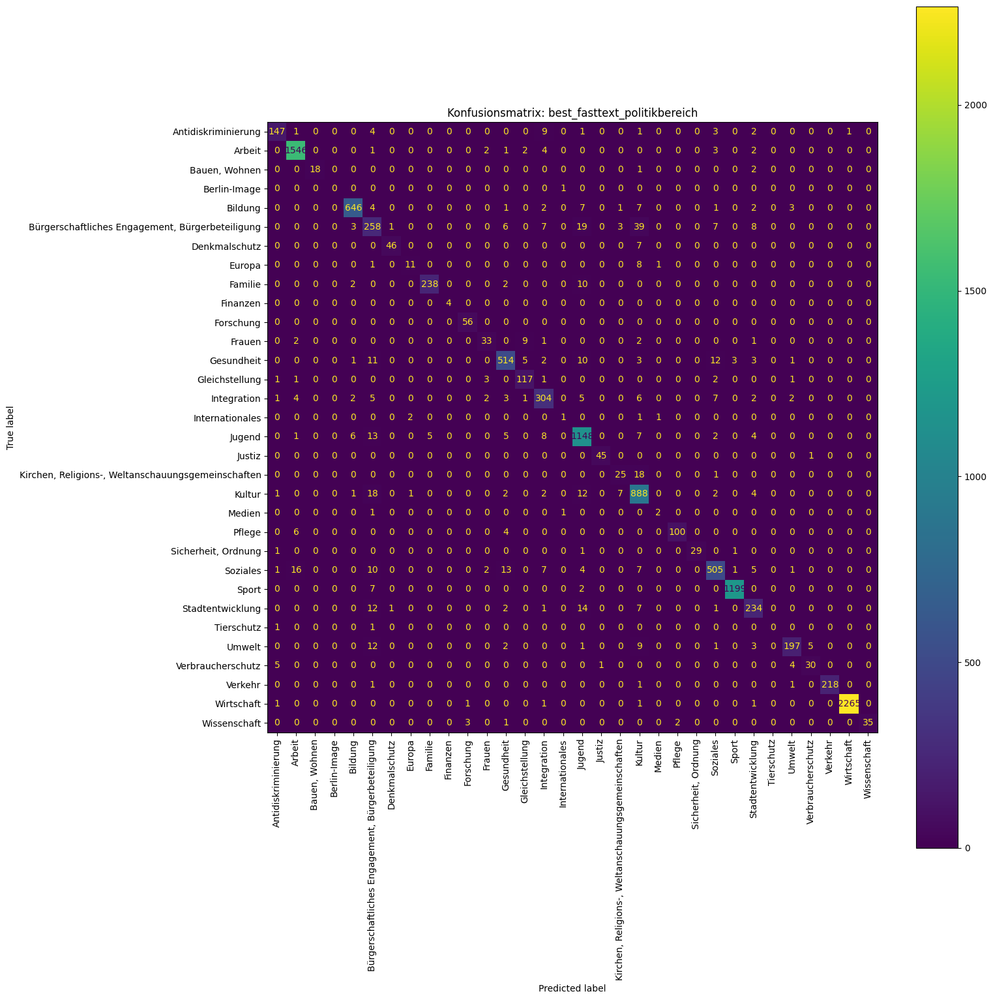

```{python}
#| include: false
from pathlib import Path
import pandas as pd
import matplotlib.pyplot as plt

PROJEKT = Path.cwd()
FARBEN = ["#1f5a7a", "#278c82", "#e39b35", "#b64d57"]
plt.rcParams.update({
    "font.size": 12,
    "axes.titlesize": 16,
    "axes.labelsize": 12,
    "axes.spines.top": False,
    "axes.spines.right": False,
})

daten = pd.read_csv(PROJEKT / "data/processed/modeling_data.csv", sep=";")
baseline = pd.read_csv(PROJEKT / "data/processed/baseline_cv_results.csv", sep=";")
ablation = pd.read_csv(PROJEKT / "data/processed/ablation_cv_results.csv", sep=";")
optuna_sgd = pd.read_csv(PROJEKT / "data/processed/optuna_tuning_results.csv", sep=";")
optuna_fasttext = pd.read_csv(PROJEKT / "data/processed/optuna_fasttext_results.csv", sep=";")
finale_ergebnisse = pd.read_csv(
    PROJEKT / "reports/final_evaluation/final_test_evaluation_results.csv", sep=";"
)
fasttext_report = pd.read_csv(
    PROJEKT / "reports/final_evaluation/classification_report_best_fasttext_politikbereich.csv",
    sep=";",
).rename(columns={"Unnamed: 0": "Politikbereich"})
```

## Ausgangslage

Das Land Berlin veröffentlicht jährlich detaillierte Daten zu staatlichen Zuwendungen. Ziel des Projekts ist ein Klassifikator, der für jede Zuwendung den zugehörigen **Politikbereich** vorhersagt.

::: {.columns}

::: {.column width="53%"}
### Eingabemerkmale

- Empfängername und Anschrift
- Fördergeber und Zuwendungsart
- Förderzweck
- Jahr und Betrag
:::

::: {.column width="43%"}
### Zielvariable

`politikbereich`

Mehrklassenproblem mit stark ungleicher Klassenverteilung.
:::

:::

::: {.notes}
Die Datengrundlage stammt aus der Berliner Zuwendungsdatenbank. Die Aufgabe ist nicht die Vorhersage des Betrags, sondern die fachliche Zuordnung einer Zuwendung zu einem Politikbereich.
:::

## Projektablauf

```{mermaid}
flowchart LR
    A[57.469 Rohzeilen] --> B[Prüfung und Bereinigung]
    B --> C[57.400 Modellzeilen]
    C --> D[Stratifizierter Split]
    D --> E[Baseline und Ablation]
    E --> F[Optuna und fastText]
    F --> G[Finaler Test]
```

<div class="source-note">Quelle: Notebooks 01–06</div>

## Datenbestand nach der Bereinigung

::: {.columns}

::: {.column width="34%"}
<div class="metric-card">
<span class="metric-value">57.400</span>
<span class="metric-label">Beobachtungen</span>
</div>

<div class="metric-card">
<span class="metric-value">32</span>
<span class="metric-label">Politikbereiche</span>
</div>
:::

::: {.column width="63%"}
```{python}
#| fig-height: 4.4
#| fig-width: 8
#| fig-cap: "Die zehn häufigsten Politikbereiche"
haeufig = daten["politikbereich"].value_counts().head(10).sort_values()
ax = haeufig.plot.barh(color="#278c82")
ax.set_xlabel("Anzahl der Zuwendungen")
ax.set_ylabel("")
ax.set_title("Starke Konzentration auf wenige Klassen", loc="left", fontweight="bold")
ax.bar_label(ax.containers[0], padding=4, fontsize=10)
plt.tight_layout()
```
:::

:::

::: {.notes}
Die Rohdaten enthielten 57.469 Zeilen und 34 Schreibvarianten der Zielklasse. Nach Standardisierung und Modellvorbereitung verbleiben 57.400 Beobachtungen und 32 konsistente Klassen.
:::

## Zentrale Herausforderung: Klassenungleichgewicht

::: {.columns}

::: {.column width="58%"}
```{python}
#| fig-height: 4.7
#| fig-width: 7.6
#| fig-cap: "Größte und kleinste Klassen im Vergleich"
counts = daten["politikbereich"].value_counts()
auswahl = pd.concat([counts.head(5), counts.tail(5)]).sort_values()
farben = ["#b64d57" if wert < 30 else "#1f5a7a" for wert in auswahl]
ax = auswahl.plot.barh(color=farben)
ax.set_xscale("log")
ax.set_xlabel("Anzahl, logarithmische Skala")
ax.set_ylabel("")
ax.bar_label(ax.containers[0], padding=4, fontsize=10)
plt.tight_layout()
```
:::

::: {.column width="39%"}
### Spannweite

- `Wirtschaft`: **11.348** Fälle
- `Berlin-Image`: **5** Fälle
- Vier Klassen mit weniger als 30 Fällen

### Konsequenz

**Macro-F1** ist die Hauptmetrik; Accuracy allein würde die großen Klassen überbetonen.
:::

:::

## Datenqualität und Aufbereitung

::: {.columns}

::: {.column width="49%"}
### Befunde

- Keine vollständig doppelten Zeilen
- Ein fehlender Förderzweck
- 1.482 fehlende Empfänger-IDs
- Stark rechtsschiefe Betragsverteilung
- Inkonsistente Schreibweisen in Text und Zielvariable
:::

::: {.column width="49%"}
### Maßnahmen

- Textnormalisierung und Standardisierung
- Vereinheitlichung der Politikbereiche
- Standardisierung von Namen und Anschriften
- Vorsichtige Rekonstruktion eindeutiger Empfänger-IDs
- Logarithmische Transformation des Betrags
:::

:::

::: {.notes}
Die ursprüngliche Empfänger-ID blieb erhalten. Eine rekonstruierte ID wurde nur bei eindeutiger Zuordnung separat gespeichert. Damit bleibt der Eingriff nachvollziehbar.
:::

## Schutz vor Data Leakage

::: {.columns}

::: {.column width="58%"}
```{mermaid}
flowchart TB
    A[Gesamtdaten] -->|80 %, stratifiziert| B[Training: 45.920]
    A -->|20 %, stratifiziert| C[Test: 11.480]
    B --> D[Stratifizierte Cross-Validation]
    D --> E[Modell- und Merkmalsauswahl]
    E --> F[Finales Training]
    F --> C
```
:::

::: {.column width="39%"}
- Fester Zufallsstartwert: `42`
- Kein separates Validierungsset wegen sehr kleiner Klassen
- Lernende Vorverarbeitung ausschließlich innerhalb der Pipeline
- Testdaten erst bei der finalen Evaluation geöffnet
:::

:::

::: {.notes}
Ein Group-CV nach Empfänger-ID wäre als Robustheitsprüfung sinnvoll. Es wurde nicht als Hauptverfahren genutzt, weil seltene Klassen dadurch in einzelnen Folds fehlen könnten.
:::

## Merkmalsrepräsentation

| Merkmalstyp | Variablen | Verarbeitung |
|---|---|---|
| Text | Name, Geber, Anschrift, Zweck | TF-IDF bzw. gemeinsamer NLP-Text |
| Kategorial | Art, Jahr | One-Hot-Encoding |
| Numerisch | Betrag | Logarithmierung und Skalierung |

Die scikit-learn-Modelle verwenden eine gemeinsame `Pipeline`. fastText erhält Feldmarker, damit Herkunft und Bedeutung der zusammengeführten Texte erhalten bleiben.

## Modellhypothesen

::: {.columns}

::: {.column width="32%"}
### Klassisch

- Dummy Classifier
- Linear SVC
- SGD mit Hinge Loss
- SGD mit Log Loss
- Logistische Regression
- Complement Naive Bayes
:::

::: {.column width="32%"}
### Gemischte Merkmale

- CatBoost
- Text, Kategorien und Zahlen in einem nichtlinearen Modell
:::

::: {.column width="32%"}
### NLP

- fastText
- German BERT / multilingual BERT vorbereitet
- BERT-Training aus Ressourcengründen nicht durchgeführt
:::

:::

## Baseline-Ergebnisse

```{python}
#| fig-height: 4.7
#| fig-width: 10.5
#| fig-cap: "Beste verfügbare Cross-Validation-Ergebnisse je Baseline-Modell"
b = baseline[(baseline["CV_Folds"] > 0) & baseline["macro_f1_mean"].notna()].copy()
b = b.sort_values("macro_f1_mean").drop_duplicates("Modell", keep="last")
b = b.sort_values("macro_f1_mean")
ax = b.plot.barh(x="Modell", y="macro_f1_mean", xerr="macro_f1_std", legend=False, color="#1f5a7a")
ax.set_xlim(0, 0.9)
ax.set_xlabel("Macro-F1, Mittelwert der Cross-Validation")
ax.set_ylabel("")
ax.axvline(0.8246, color="#e39b35", linestyle="--", linewidth=1)
for balken, wert in zip(ax.patches, b["macro_f1_mean"]):
    ax.text(wert + 0.012, balken.get_y() + balken.get_height() / 2, f"{wert:.3f}", va="center", fontsize=10)
plt.tight_layout()
```

**Stärkste Baseline:** balancierte logistische Regression mit Macro-F1 **0,825 ± 0,006**.

## Was lernen wir aus der Ablation?

```{python}
#| fig-height: 4.8
#| fig-width: 10.5
#| fig-cap: "Einfluss der verwendeten Merkmalsgruppen bei festem SGD-Hinge-Modell"
a = ablation.sort_values("macro_f1_mean").copy()
ax = a.plot.barh(x="Ablation", y="macro_f1_mean", legend=False, color="#278c82")
ax.set_xlim(0.55, 0.84)
ax.set_xlabel("Macro-F1, Mittelwert der Cross-Validation")
ax.set_ylabel("")
ax.bar_label(ax.containers[0], fmt="%.3f", padding=4, fontsize=9)
plt.tight_layout()
```

::: {.notes}
Die beste Variante kombiniert Text mit kategorialen Merkmalen. Nur der Förderzweck ist deutlich schwächer. Name und Anschrift enthalten daher einen erheblichen, möglicherweise empfängerspezifischen Informationsanteil.
:::

## Interpretation der Merkmale

::: {.columns}

::: {.column width="48%"}
### Leistungsgewinn

- `Text + categorical`: Macro-F1 **0,817**
- Vollständiges Modell: **0,806**
- Nur Text: **0,802**
- Nur Förderzweck: **0,599**
:::

::: {.column width="48%"}
### Fachliches Risiko

Name und Anschrift können als indirekte Empfängerkennung wirken. Ein hoher Score bedeutet deshalb nicht automatisch, dass das Modell ausschließlich den Inhalt des Förderzwecks versteht.

**Produktiv notwendig:** Robustheit gegenüber neuen Empfängern prüfen.
:::

:::

## Hyperparameteroptimierung

::: {.columns}

::: {.column width="49%"}
### SGD mit Hinge Loss

- Optuna auf vier CV-Folds
- Beste Regularisierung: Elastic Net
- `alpha`: 8,13 × 10⁻⁶
- `l1_ratio`: 0,066
- Macro-F1: **0,851 ± 0,005**
- Accuracy: **0,941 ± 0,003**
:::

::: {.column width="49%"}
### fastText

- Interner stratifizierter Validierungssplit
- 37 Epochen, Lernrate 0,635
- Wort-n-Gramme bis Länge 3
- Einbettungsdimension 200
- Macro-F1: **0,818**
- Accuracy: **0,938**
:::

:::

::: {.notes}
Die Optuna-Zielgröße war Macro-F1. Die logistische Regression und BERT wurden aus Laufzeit- beziehungsweise Ressourcenbegrenzungen nicht vollständig optimiert.
:::

## Finale Bewertung auf 11.480 Testfällen

```{python}
#| fig-height: 4.5
#| fig-width: 10.5
#| fig-cap: "Vergleich der drei gespeicherten Modellkandidaten auf dem unangetasteten Testdatensatz"
labels = {
    "best_fasttext_politikbereich": "fastText",
    "best_optuna_sgd_hinge": "SGD Hinge (Optuna)",
    "logistic_regression_balanced__full_model": "Logistische Regression",
}
f = finale_ergebnisse.copy()
f["Modell"] = f["model_name"].map(labels)
plot = f.set_index("Modell")[["test_accuracy", "test_macro_f1", "test_balanced_accuracy"]]
plot.columns = ["Accuracy", "Macro-F1", "Balanced Accuracy"]
ax = plot.plot.bar(color=["#1f5a7a", "#e39b35", "#278c82"], rot=0)
ax.set_ylim(0.45, 1.0)
ax.set_ylabel("Score")
ax.set_xlabel("")
ax.legend(ncol=3, loc="upper center", bbox_to_anchor=(0.5, 1.14), frameon=False)
for container in ax.containers:
    ax.bar_label(container, fmt="%.3f", padding=3, fontsize=9)
plt.tight_layout()
```

## Zwei Gewinner – abhängig vom Ziel

::: {.columns}

::: {.column width="48%"}
<div class="result-card blue">
<div class="result-title">Höchste Accuracy</div>
<div class="result-model">SGD Hinge (Optuna)</div>
<div class="result-score">94,72 %</div>
<div>Balanced Accuracy: 81,13 %<br>Macro-F1: 79,99 %</div>
</div>
:::

::: {.column width="48%"}
<div class="result-card gold">
<div class="result-title">Höchster Macro-F1</div>
<div class="result-model">fastText</div>
<div class="result-score">80,78 %</div>
<div>Accuracy: 94,59 %<br>Balanced Accuracy: 79,07 %</div>
</div>
:::

:::

**Modellauswahl:** fastText, wenn die gleichmäßige Leistung über alle Politikbereiche Priorität hat; SGD Hinge, wenn Accuracy oder durchschnittlicher Recall je Klasse wichtiger ist.

## Klassenbezogene Leistung von fastText

```{python}
#| fig-height: 4.9
#| fig-width: 10.8
#| fig-cap: "F1-Score je Politikbereich; Klassen mit weniger als 30 Testfällen sind markiert"
r = fasttext_report[~fasttext_report["Politikbereich"].isin(["accuracy", "macro avg", "weighted avg"])].copy()
r = r.sort_values("f1-score")
farben = ["#b64d57" if s < 30 else "#278c82" for s in r["support"]]
ax = r.plot.barh(x="Politikbereich", y="f1-score", legend=False, color=farben, figsize=(10.8, 6.2))
ax.set_xlim(0, 1.03)
ax.set_xlabel("F1-Score")
ax.set_ylabel("")
ax.axvline(r["f1-score"].mean(), color="#e39b35", linestyle="--", linewidth=1.5, label="Klassenmittel")
plt.tight_layout()
```

::: {.notes}
Die roten Balken kennzeichnen Klassen mit weniger als 30 Testfällen. Bei diesen Klassen ist die Kennzahl besonders unsicher. Der aggregierte Macro-F1 muss deshalb immer zusammen mit Support und Einzelklassen betrachtet werden.
:::

## Typische Verwechslungen

{fig-alt="Konfusionsmatrix des fastText-Modells für 32 Politikbereiche" width="76%"}

<div class="source-note">Konfusionsmatrix aus dem Notebook zur finalen Evaluation</div>

::: {.notes}
Die stärksten absoluten Diagonalwerte entstehen bei den großen Klassen. Inhaltlich ähnliche Felder wie Soziales, Gesundheit, Integration und bürgerschaftliches Engagement werden häufiger miteinander verwechselt. Bei sehr kleinen Klassen reichen einzelne Fehler für starke Schwankungen.
:::

## Grenzen der Untersuchung

::: {.columns}

::: {.column width="48%"}
- Extrem kleine Klassen begrenzen belastbare Aussagen
- Empfängermerkmale können Proxy-Effekte erzeugen
- Keine zusätzliche Group-CV nach Empfänger-ID
- BERT nur vorbereitet, nicht trainiert
:::

::: {.column width="48%"}
- Nicht alle langsamen Modelle vollständig optimiert
- Keine Ensemble-Verfahren
- Keine zeitbasierte Robustheitsprüfung
- Keine produktive Kalibrierung oder Ablehnungsoption
:::

:::

## Empfehlungen

1. **Group-CV und zeitbasierte Tests** ergänzen, um neue Empfänger und spätere Jahre realistisch abzubilden.
2. **Seltene Klassen** fachlich prüfen, zusammenlegen oder gezielt mit zusätzlichen Daten stärken.
3. **Fehleranalyse** für ähnliche Politikbereiche gemeinsam mit Fachexperten durchführen.
4. **Transformer und Ensembles** mit GPU und Optuna-Pruning systematisch testen.
5. Für den Betrieb eine **Konfidenzschwelle** einführen und unsichere Fälle manuell prüfen.

## Fazit

::: {.columns}

::: {.column width="64%"}
- Eine reproduzierbare Pipeline deckt den gesamten Weg von der Datenprüfung bis zum finalen Test ab.
- Lineare TF-IDF-Modelle und fastText erreichen trotz 32 unausgewogener Klassen eine Accuracy von rund **95 %**.
- Der beste Macro-F1 von **0,808** zeigt zugleich, dass seltene Klassen die zentrale offene Herausforderung bleiben.
:::

::: {.column width="32%"}
<div class="takeaway">
Nicht nur die Gesamtgenauigkeit zählt – entscheidend ist die robuste Leistung in jedem Politikbereich.
</div>
:::

:::

## Vielen Dank {.center}

### Fragen und Diskussion

<div class="source-note">Datengrundlage: Berliner Zuwendungsdatenbank · Analyse: Notebooks 01–06</div>

::: {.notes}
Zum Abschluss die gewünschte Zielmetrik klären: Soll im Einsatz die Gesamtgenauigkeit maximiert oder sollen seltene Politikbereiche möglichst gleichmäßig erkannt werden?
:::
